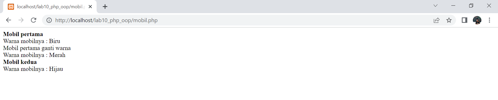
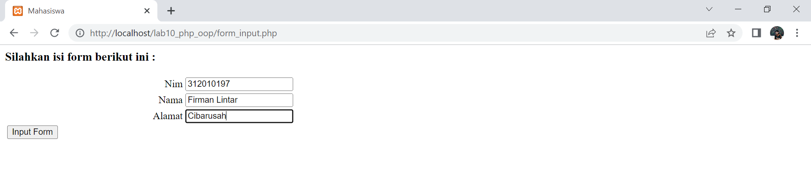

| Nama      | Firman Lintar Nurrohman |
| ----------- | ----------- |
| NIM     | 312010197       |
| Kelas   | TI.20.A.1        |

# DAFTAR TUGAS

<table border="2" cellpading="10">
  <tr>
    <td><b>Praktikum 1</b></td>
    <td>HTML Dasar</td>
    <td><a href="https://github.com/firmanlintar/lab1web">Klik disini</td>
  </tr>
  <tr>
    <td><b>Praktikum 2</b></td>
    <td>CSS Dasar</td>
    <td><a href="https://github.com/firmanlintar/lab2web">Klik disini</td>
  </tr>
  <tr>
    <td><b>Praktikum 3</b></td>
    <td>Membuat List, Table dan Form</td>
    <td><a href="https://github.com/firmanlintar/lab3web">Klik disini</td>
  </tr>
  <tr>
    <td><b>Praktikum 4</b></td>
    <td>CSS Layout</td>
    <td><a href="https://github.com/firmanlintar/lab4web">Klik disini</td>
  </tr>
  <tr>
  <td><b>Praktikum 5</b></td>
    <td>Javascript</td>
    <td><a href="https://github.com/firmanlintar/lab5web">Klik disini</td>
</tr>
<tr>
  <td><b>Praktikum 6</b></td>
    <td>Web Framework</td>
    <td><a href="https://github.com/firmanlintar/lab6web">Klik disini</td>
</tr>
<tr>
  <td><b>Praktikum 7</b></td>
    <td>PHP Dasar</td>
    <td><a href="https://github.com/firmanlintar/lab7web">Klik disini</td>
</tr>
<tr>
  <td><b>Praktikum 8</b></td>
    <td>PHP dan Database MySQL</td>
    <td><a href="https://github.com/firmanlintar/lab8web">Klik disini</td>
</tr>
<tr>
  <td><b>Praktikum 9 & 10</b></td>
    <td>PHP Modular</td>
    <td><a href="https://github.com/firmanlintar/lab9web">Klik disini</td>
</tr>
<tr>
  <td></td>
    <td>PHP OOP</td>
    <td><a href="https://github.com/firmanlintar/lab10web">Klik disini</td>
</tr>
<tr>
    <td><b>Praktikum 11</b></td>
    <td>PHP Framework (Codeigniter)</td>
    <td><a href="https://github.com/firmanlintar/lab11web">Klik disini</td>
  </tr>
<tr>
    <td><b>Praktikum 12</b></td>
    <td>Framework Lanjutan (CRUD)</td>
    <td><a href="https://github.com/firmanlintar/lab12web">Klik disini</td>
  </tr>
<tr>
    <td><b>Praktikum 13</b></td>
    <td>Framework Lanjutan (Modul Login)</td>
    <td><a href="https://github.com/firmanlintar/lab13web">Klik disini</td>
  </tr>
  <tr>
    <td><b>Praktikum 14</b></td>
    <td>Pagination dan Pencarian</td>
    <td><a href="https://github.com/firmanlintar/lab14web">Klik disini</td>
  </tr>
  <tr>
</table>_________________________________________________________________________________
_________________________________________________________________________________


## Langkah langkah praktikum
# PHP OOP

### 1. Buat file baru dengan nama mobil.php
- Kode nya seperti dibawah ini :
```php
<?php
/**
* Program sederhana pendefinisian class dan pemanggilan class.
**/
class Mobil
{
    private $warna;
    private $merk;
    private $harga;

    public function __construct()
    {
        $this->warna = "Biru";
        $this->merk = "BMW";
        $this->harga = "10000000";
    }

    public function gantiWarna ($warnaBaru)
    {
        $this->warna = $warnaBaru;
    }

    public function tampilWarna ()
    {
        echo "Warna mobilnya : " . $this->warna;
    }
}

// membuat objek mobil
$a = new Mobil();
$b = new Mobil();

// memanggil objek
echo "<b>Mobil pertama</b><br>";
$a->tampilWarna();

echo "<br>Mobil pertama ganti warna<br>";
$a->gantiWarna("Merah");
$a->tampilWarna();

// memanggil objek
echo "<br><b>Mobil kedua</b><br>";
$b->gantiWarna("Hijau");
$b->tampilWarna();
?>
```

- Output :


### 2. Buat file baru dengan nama form.php
- Kode nya seperti dibawah ini :
```php
<?php
/**
* Nama Class: Form
* Deskripsi: CLass untuk membuat form inputan text sederhana
**/
class Form
{
    private $fields = array();
    private $action;
    private $submit = "Submit Form";
    private $jumField = 0;

    public function __construct($action, $submit)
    {
        $this->action = $action;
        $this->submit = $submit;
    }

    public function displayForm()
    {
        echo "<form action='".$this->action."' method='POST'>";
        echo '<table width="100%" border="0">';
        for ($j=0; $j<count($this->fields); $j++) {
            echo "<tr><td
            align='right'>".$this->fields[$j]['label']."</td>";
            echo "<td><input type='text'
            name='".$this->fields[$j]['name']."'></td></tr>";
        }
        echo "<tr><td colspan='2'>";
        echo "<input type='submit' value='".$this->submit."'></td></tr>";
        echo "</table>";
    }

    public function addField($name, $label)
    {
        $this->fields [$this->jumField]['name'] = $name;
        $this->fields [$this->jumField]['label'] = $label;
        $this->jumField ++;
    }
}
?>
```

### 3. Buat file baru dengan nama form_input.php
- Kode nya seperti dibawah ini
```php
<?php
/**
* Program memanfaatkan Program 10.2 untuk membuat form inputan sederhana.
**/

include "form.php";

echo "<html><head><title>Mahasiswa</title></head><body>";
$form = new Form("","Input Form");
$form->addField("txtnim", "Nim");
$form->addField("txtnama", "Nama");
$form->addField("txtalamat", "Alamat");
echo "<h3>Silahkan isi form berikut ini :</h3>";
$form->displayForm();
echo "</body></html>";
?>
```

- Output
